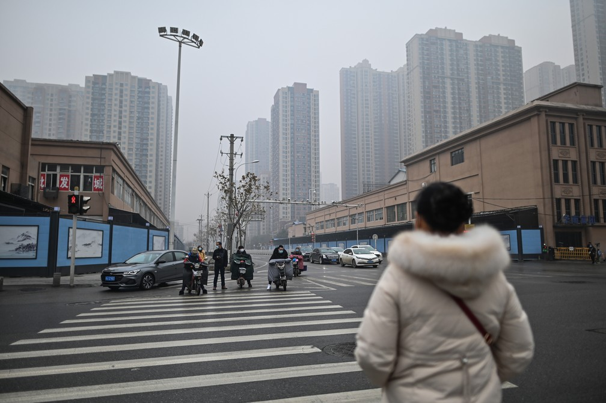

<!DOCTYPE html>
<!-- saved from url=(0052)file:///C:/Users/cmila/Downloads/covid-19%20(2).html -->
<html lang="pt-br">
<head>
    <meta http-equiv="Content-Type" content="text/html; charset=UTF-8">
    <meta name="viewport" content="width=device-width, initial-scale=1.0">
    <link rel="shortcut icon" href="file:///C:/Users/cmila/Downloads/favicon.png" type="image/x-icon">
     <title>Covid-19</title>
     <link rel="stylesheet" href="style.css">
</head>
<body>    
    <h1>O novo coronavírus</h1>
    <h2>O início da pandemia</h2>
    

    
    
O misterioso novo coronavírus, que causa a infeção COVID-19, surgiu em 2019 na cidade de <em>Wuhan-China</em>. Os
   primeiros casos da infecção parecem ter acontecido de animais para pessoas. 
   Isso porque os vírus da família "coronavírus" afetam principalmente animais,
   existindo quase 40 tipos diferentes desse vírus identificados em animais e apenas 7 tipos em humanos. 
   <picture>
       <source media="(max-width: 600px)" srcset="wuham_300.jpg" type="image/jpg">
       <source media="(max-width: 900px)" srcset="wuham_650.jpg" type="image/jpg">      
       
    </picture>

Em fevereiro de 2020, a transmissão da Covid-19, nome dado à doença causada pelo SARS-CoV2, 
    no Irã e na Itália <strong>chamaram a atenção pelo crescimento rápido de novos casos e mortes</strong>, 
    fazendo com que o Ministério da Saúde alterasse a definição de caso suspeito para incluir
     pacientes que estiveram em outros países. 
    No mesmo dia, o primeiro caso do Brasil foi identificado, em São Paulo.

<mark> Em março, a Organização Mundial da Saúde (OMS) definiu o surto da doença como pandemia.</mark> 
Poucos dias depois, foi confirmada a primeira morte no Brasil, em São Paulo. No mesmo dia,
 dois pacientes que haviam testado positivo para coronavírus,
 do Rio de Janeiro, vieram a óbito.

 <h2> Precauções</h2>
 
Lave suas mãos com frequência,  Use sabão e água ou álcool em gel,  
    Mantenha uma distância segura de pessoas que estiverem tossindo ou espirrando, 
    Use máscara quando não for possível manter o distanciamento físico, 
    Não toque nos olhos, no nariz ou na boca, 
    Cubra seu nariz e boca com o braço dobrado ou um lenço ao tossir ou expirrar.  
    <iframe width="560" height="315" src="https://www.youtube.com/embed/LwUjglzIUhc" title="YouTube video player" frameborder="0" allow="accelerometer; autoplay; clipboard-write; encrypted-media; gyroscope; picture-in-picture" allowfullscreen></iframe>

    <h2> Sintomas</h2>
    <h3> Mais comuns:</h3>
    <ul> <li> febre</li>
    <li>tosse seca</li>
    <li>cansaço</li></ul>
    <h3> Menos comuns:</h3>
    <ul><li>dores e desconfortos</li>
    <li>dor de garganta</li>
    <li> conjuntivite</li>
    <li> dor de cabeça</li>
    <li> perda de paladar ou olfato</li>
    <li> erupção cutânea na pele ou descoloração dos dedos das mãos ou dos pés</li> </ul>
    <h3> Graves:</h3>
    <ul><li>dificuldade de respirar ou falta de ar</li>
    <li> dor ou pressão no peito</li>
    <li> perda de fala ou movimento</li>
    

    

    <ul>
        <li><a href="file:///C:/Users/cmila/Desktop/projeto%2006.1/A%20vacina%C3%A7%C3%A3o!.html" target="_blank">>Saiba mais sobre a vacinação contra a covid-19</a></li>
        <li><a href="file:///C:/Users/cmila/Desktop/projeto%2006.1/Coronav%C3%ADrus%20Macei%C3%B3.html" target="_blank">Veja como está a Covid-19 em Maceió</a></li>
     
       

</ul></ul></body></html>
